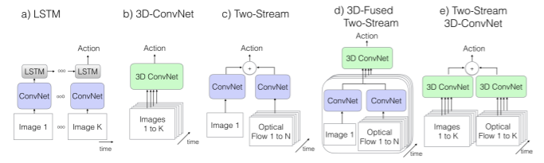

## **Introduction**

Action Recognition pipeline consists of 2 main stages: YoloV3 Pedestrian Detection with DeepSORT Tracker + 3D Conv-Net for Action Classification. All the code below has been run with tensorflow-gpu v1.14.0.


This repo will consist of 4 main parts:

 1. Pedestrian Detection and Tracking 
	 - Extracting Frames
	 - Data Labelling
 2. Action Classification
	 - Data
	 - Architecture
	 - Loss Function
	 - Optimiser
 4. Training
 5. Infrence

I would recommend upgrading to tensorflow-gpu v2.1.0 which should run faster then v1.14.0 due to the optimisations made. However, that requires a CUDA version of 10.1, which was troublesome to upgrade to when I was doing the project.

## 1. **Pedestrian Detection and Tracking**

Code has been modified from [https://github.com/Qidian213/deep_sort_yolov3](https://github.com/Qidian213/deep_sort_yolov3). In particular, only the `demo.py` has been modified and changed to `extract_frames.py`. You will also need a folder called **model_data**, which was too big to be uploaded. It can be downloaded here: https://drive.google.com/drive/folders/1xIyF1sufsw_JDj_igUUNSrYFS390gUlS?usp=sharing.

 - **Extracting Frames**

`extract_frames.py` is used to extract 224x224 frames of pedestrian from videos and label it with a ID. The same IDs are then saved in the same folder. To do this, organise all your videos (in MP4/avi format) into a folder titled **videos**. The output will be saved the in the same directory as `extract_frames.py` and will have the same name as the video name. Under each video's folder, there are folders of photos with the folder names corresponding to the ID of the pedestrian detected.

The folder should look as such after running `extract_frames.py`:
```
extract_frames.py
yolo.py
yolo.pyc
yolo3
tools
model_data
deep_sort
└── videos
    └── vid1.mp4
    └── vid2.mp4
    └── vid3.mp4
    └── vid4.mp4
└── vid1
	└── 1
		└── 1.jpg
		└── 2.jpg
		.
		.
		.
	└── 2
	└── 3
└── vid2
	└── 4
	└── 5
	└── 6
```

To collect data for training, I experimented with a sparse sampling of 16 frames from 64 frames, dense sampling of 32 and 64 consecutive frames. From my experiments, dense sampling of 64 consecutive frames gave the best prediction outcome. 

After the frames are extracted, I then group 64-80 frames of the same person as one training example. The grouping is done by using `group_frames.py`. The file should be in the same folder as all the video folders as seen below. Before you run the script, specify the video folder on line 6 (Make sure there are no spaces in the folder name) and the classes on line 17. The classes folder should be created before the script is run. The folder directory should look the same as below:
```
└── vid1
	└── 4
	└── 5
	└── 6
class1
class2
class3
group_frames.py
```

 - **Data Labelling**

There are some actions which typically occur in the span of less than 64 frames (e.g. Fighting). For cases like those, I group as many consecutive frames as I can as one training example. I then run `reverse_oversample.py`. Let's say I have frame 0-31, reverse_oversample.py reverses the order the generates frames 32 onwards, until I have more than 64 frames. After that, I run `generate_64.py` to convert the frames into a video (avi format) by taking the first 64 frames and the last 64 frames of each training example. It also produces a  text file, with each line containing the video path and its class, in the form of an integer (e.g. 1=Fighting).  Contents of the text file need to be copied into **datasetlist/trainlist.txt** or **datasetlist/vallist.txt**, depending on whether they are used for training or validation.

## **2. Action Classification**




I decided not to proceed with method A as LSTMs are hard to train. Methods involving optical flows were also eliminated due to computational overhead, making it hard to achieve real-time speeds and also noisy backgrounds, reducing the accuracy of predictions made with optical flow.

The architecture I used in the end was a 3D Inception network introduced by this paper: [https://arxiv.org/pdf/1705.07750.pdf](https://arxiv.org/pdf/1705.07750.pdf). The Keras code for the network was taken from: [https://github.com/dlpbc/keras-kinetics-i3d/blob/master/i3d_inception.py](https://github.com/dlpbc/keras-kinetics-i3d/blob/master/i3d_inception.py).

On top of the 3D Inception Network, I introduced Squeeze-and-Excite (SE) Modules first introduced here: [https://arxiv.org/pdf/1709.01507.pdf](https://arxiv.org/pdf/1709.01507.pdf). The idea was that it added little computational overhead, while being able to put attention on certain channels. I extended the concept further by placing attention across the temporal and the channel axis. My implementation of this can be found in se.py.

To train the network, I created a custom `DataGenerator` class for videos which is similar to the `ImageDataGenerator` class in Keras. This is found in data_gen.py. To manipulate how the data is generated on the fly for training, look in to the `__data_generation` under `data_gen.py`.

To get the best model, I tuned 4 things in the training process:

 - **Data**

The data I used in the end belonged to 3 classes: Fighting, Standing, Walking. Fighting videos were taken from XRVision's simulated videos, street fight videos (Search "prison fight", "street fight" in Youtube) and also workout videos (Kickboxing and BodyCombat workouts). Standing and Walking videos were taken from XRVision's simulated videos and also from BEHAVE Dataset.

Currently, I am experimenting adding workout videos, which does not have punches/kicks to improve the robustness of the model.

 - **Architectures**

Although I chose Inception in the end, there are other architectures that I tried. I tried lightweight architectures like MobileNetV3 ([https://arxiv.org/pdf/1905.02244.pdf](https://arxiv.org/pdf/1905.02244.pdf)) and ShuffleNetV2 ([https://arxiv.org/pdf/1807.11164.pdf](https://arxiv.org/pdf/1807.11164.pdf)) to improve inference speed.

I also tried Video Action Transformer Network (VATN) from [https://arxiv.org/pdf/1812.02707.pdf](https://arxiv.org/pdf/1812.02707.pdf) and SlowFast Network from [https://arxiv.org/pdf/1812.03982.pdf](https://arxiv.org/pdf/1812.03982.pdf).

The models can be found in `mobilenet_base.py`, `VATN.py`, `slowfast.py`.
 - **Loss Function**

Initially, due to the lack of fighting videos, I used focal loss to deal with the class imbalance. The idea of focal loss is as such: Assuming I have 3 classes and my example is Class 0, the ground truth is [1,0,0]. Focal loss shifts that threshold lower, so any sensibly high values such as [0.8, 0.1, 0.1] will not contribute much to the final loss. A visual explanation can be seen below. The implementation of this can be found in the `categorical_focal_loss` function in train.py. To use it, you just have to compile the Keras model with that loss function. However, this led to slower convergence. 


As I collected more fighting videos, I used categorical cross entropy instead, which allowed for faster convergence.
- **Optimizer**

I used a rectified ADAM optimiser (RADAM), which is experimentally shown to provide greater stability during the initial phases of training ([https://arxiv.org/pdf/1908.03265.pdf](https://arxiv.org/pdf/1908.03265.pdf)). I also combined it with a Lookahead optimiser, which also helped with the stability of training ([https://arxiv.org/pdf/1907.08610.pdf](https://arxiv.org/pdf/1907.08610.pdf)).

## **3. Training**

Lastly, to train the network, make sure **dataset_list/trainlist.txt** and **dataset_list/vallist.txt** contains all the training and validation examples you want to use. Also, create a **save_weight** folder as that is the folder where the model weights will be saved. Run the following command to train:

    python train.py --batchsize 8 --mode RGB --num_class 3 --qs 10 --workers 4 

`batchsize` determines batch size in training. `mode` determines modality of images where RGB/Flow/Fuse can be used. `num_class` determine the number of classes in your training examples, `qs` determines the max queue size of data that your CPU prepares to be sent to the GPU (Reduce this if you are facing OOM error). `workers` determine the number of threads that is opened to generate the data (Dependent on CPU).

## **4. Inference**

To run inference, use the following command:

    python predict.py --mode RGB --path model.hdf5 --video test1.mp4 --batch False

`mode` determines modality of images where RGB/Flow/Fuse can be used. `path` refers to the file containing the model architecture and weights. `video` refers to the video that you want to run the inference on. `batch` determine whether to use batching or not (Limited by GPU memory).